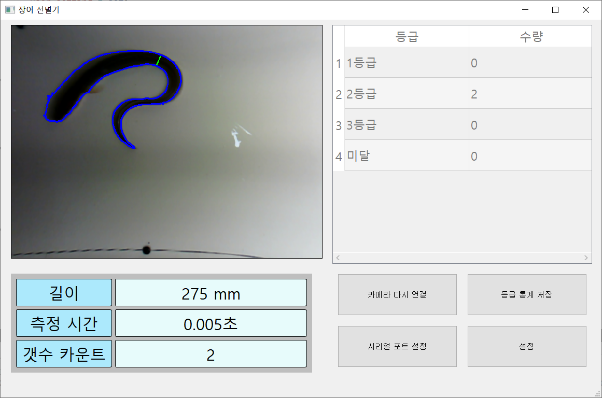

# Image processing eel sorter
장어 선별기에 사용될 소프트웨어 입니다. 

움직이는 장어의 길이를 카메라 영상처리를 이용하여 순간적으로 측정하는 프로그램입니다.

## 스크린샷
 

## 라이브러리
OpenCV

Qt

## 개발 하드웨어
카메라 : [oCam-5CRO-U-M](https://github.com/withrobot/oCam/tree/master/Products/oCam-5CRO-U-M)
